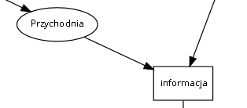
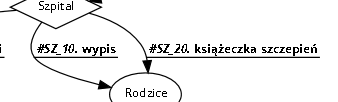
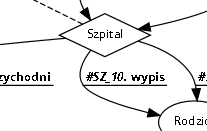
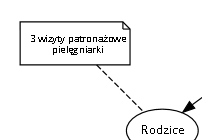

# Schemat postępowania dla rodziców

## Kogo dotyczy schemat?
Rodziców, którzy są na dowolnym etapie ochrony swoich dzieci przed bezmyślnym systemem szczepień w Polsce. Idea jest taka, aby rodzic zawsze mógł zidentyfikować swoje aktualne miejsce w systemie i co może zrobić dalej oraz co go może czekać w przyszłości i o co ewentualnie warto zadbać już teraz.

## Co zawiera schemat?
Bloki, strzałki i opisy. Bloki zawsze reprezentują podmioty np. rodziców, PPIS, Wojewodę, przychodnię. Strzałki zawsze reprezentują czynności do wykonania lub dokumenty, które są przekazywane pomiedzy podmiotami. Opisy zawierają dodatkowe informacje dotyczące danego miejsca w schemacie.

## Co oznaczają symbole przed opisami strzałek?
Strzałki są oznaczane identyfikatorami, np. "#RO_90" albo "#WO_20". Identyfikatory służą do znalezienia opisu danego dokumentu lub czynności do wykonania w poniższym indeksie. Każdy identyfikator rozpoczyna się symbolem "#", następnie są dwie duże litery oznaczające podmiot (np. RO - rodzice, WO - wojewoda), następnie symbol podkreślenia "_" oraz na końcu liczba określająca kolejny numer porządkowy zarejestrowanego na schemacie dokumentu. Pełen identyfikator służy do sprawnego znalezienia opisu czynności czy dokumentu, do dyskusji o konkretnych czynnościach czy to na forum SN czy w innych mediach.

## Jakie narzędzie zostało wykorzystane do jego opracowania?
Aplikacja to [Code2Flow](https://code2flow.com/app). Gorąco polecam!

## Jaki jest stan prac nad schematem?
Wczesny etap. W trakcie opracowywania. W pierwszej kolejności jest dodawana podstawowa ścieżka administracyjna czyli postępowanie egzekucyjne. Docelowo będą tam się znajdowały również ścieżki alternatywne w tym ogólne schematy odwoławcze (np. do zastosowania do każdego pisma, które jest nieprawidłowo doręczone).

## Czy to nie jest zbyt ambitny projekt?
Na pewno jest ciekawy. Zobaczymy co z niego wyjdzie. Cel jest jeden - aby to było przydatne dla rodziców.

## Zauważyłem błąd, mam pomysł na dodanie czegoś, proponuję uzupełnienie!
TAK! Pomoc i dyskusja jest niezbędna. Uwagi proszę zgłaszać najlepiej do tego wątku na forum SN albo w uwagach do tego repozytorium. Idealne zmiany to zawsze oczywiście tzw. "pull request" do tego repozytorium.

## Co oznaczają poszczególne symbole na schemacie?

Bloki to prostokąty lub elipsy. Oznaczają podmioty:

Strzałki oznaczają czynności lub przekazywane dokumenty. Strzałki są oznaczone identyfikatorami. Wg identyfikatora możemy znaleźć jej opis:

Romby oznaczają decyzje lub działania jednoczesne. Dość częsta sytuacja niestety:

Opisy są oznaczone prostokątami z mała zakładką i są dołączone przez linię przerywaną. Być może warto rozważyć również opatrywanie ich identyfikatorami?

## Gdzie znajdę pliki ze schematem do wykorzystania?
1. Plik w formacie do wydruku, podglądu, powiększania [schemat.pdf](schemat.pdf).
2. Plik wektorowy do wykorzystania np. na stronach HTML [schemat.svg](schemat.svg)

## Schemat graficzny

## Indeks opisów

Poniżej znajdują się linki do opisów strzałek wg ich identyfikatów:

- [grupa GI](grupa_GI.md) - GIODO
- [grupa GS](grupa_GS.md) - Główny Inspektor Sanitarny - GIS
- [grupa IZ](grupa_IZ.md) - Izba Lekarska
- [grupa MZ](grupa_MZ.md) - Minister Zdrowia
- [grupa NO](grupa_NO.md) - Notariusz
- [grupa NS](grupa_NS.md) - Naczelny Sąd Administracyjny - NSA
- [grupa OE](grupa_OE.md) - Organ Egzekucyjny
- [grupa OG](grupa_OG.md) - organ administracji publicznej działający w trybie przepisów k.p.a.
- [grupa PR](grupa_PR.md) - Prokurator
- [grupa PS](grupa_PS.md) - Państwowy Powiatowy Inspektor Sanitarny - PPIS
- [grupa PZ](grupa_PZ.md) - przychodnia
- [grupa RO](grupa_RO.md) - rodzice
- [grupa SZ](grupa_SZ.md) - szpital
- [grupa TK](grupa_TK.md) - Trybunał Konstytucyjny
- [grupa WI](grupa_WI.md) - Państwowy Wojewódzki Inspektor Sanitarny - WIS
- [grupa WO](grupa_WO.md) - Wojewoda
- [grupa WS](grupa_WS.md) - Wojewódzki Sąd Administracyjny - WSA
