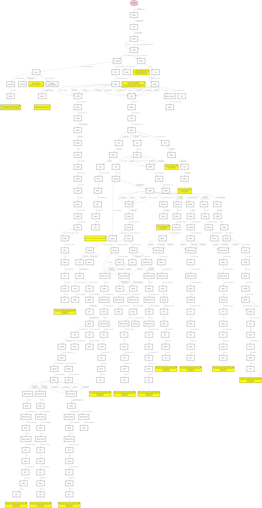

# Schemat postępowania dla rodziców

## Kogo dotyczy schemat?
Rodziców, którzy są na dowolnym etapie ochrony swoich dzieci przed bezmyślnym systemem szczepień w Polsce. Idea jest taka, aby rodzic zawsze mógł zidentyfikować swoje aktualne miejsce w systemie, wiedział co może zrobić dalej oraz co go może czekać w przyszłości a o co warto zadbać już teraz.

## Co zawiera schemat?
Bloki, strzałki i opisy. Bloki zawsze reprezentują podmioty np. rodziców, PPIS, Wojewodę, przychodnię. Strzałki zawsze reprezentują czynności do wykonania lub dokumenty, które są przekazywane pomiedzy podmiotami. Opisy zawierają dodatkowe informacje dotyczące danego miejsca w schemacie.

## Na jakim etapie prac jest schemat?
Obecnie jest to jego pierwsza wersja. KONIECZNIE jest niezbędna weryfikacja prawna i merytoryczna. W szczególności sam początek, czyli czynności związane ze szpitalem i przychodniami wymagają sprawdzenia w związku z obecnym brzemieniem przepisów. Pomoc mile widziana.

## Co oznaczają symbole przed opisami strzałek?
Strzałki są oznaczane identyfikatorami, np. "RO_90" albo "WO_20". Identyfikatory służą do znalezienia opisu danego dokumentu lub czynności do wykonania w poniższym indeksie czynności i dokumentów. Każdy identyfikator to dwie duże litery oznaczające podmiot (np. RO - rodzice, WO - wojewoda), następnie symbol podkreślenia "_" oraz na końcu liczba określająca kolejny numer porządkowy zarejestrowanego na schemacie dokumentu. Pełen identyfikator służy do znalezienia opisu czynności czy dokumentu, do dyskusji o konkretnych czynnościach czy to na forum SN czy w innych mediach. Na teraz tylko część strzałek jest opatrzona takimi opisami. Praca w toku, pomoc mile widziana.

## Co oznaczają symbole za opisami strzałek?
Przy niektórych strzałkach można spotkać się z symbolem np. {R:7} - literka R oznacza, że jest to pismo nr 7 z [listy ścieżek alternatywnych w repozytorium pism i dokumentów](../Sciezki%20alternatywne/README.md). Jeśli spotkamy się z oznaczeniem {S:10}, w takiej sytuacji literka S oznacza krok nr 10 ze [wzorów dokumentów Stop NOP](http://www.pisma.szczepienia.org.pl/wzory-pism.html).

## Dlaczego ten schemat jest tak duży?
Aktualnie schemat to ok. 170 możliwych dokumentów w sprawie szczepień. Jednakże to nie jest wszystko. Jeśli doliczymy standardowe ścieżki odwoławcze (skargi, zażalenia, polemiki, bezczynność/przewlekłość), wtedy rodzice mogą osiągnąć nawet i ponad 350 dokumentów, zanim organ będzie w stanie cokolwiek zrobić sensownego. Warto zwrócić uwagę, że schemat  pokazuje ścieżkę dla jednego rodzica, który uzyskuje pełnomocnictwo od drugiego. Gdyby sprawy prowadziło obydwoje rodziców osobno, wtedy jest możliwość nie tylko podwojenia liczby dokumentów ale jeszcze ich zwiększenia o dodatkowe ścieżki.

## Dlaczego ścieżka znana ze wzorów dokumentów jest tak krótka?
Bo wzory zaprezentowane na stronie STOP NOP to jest minimalna ścieżka odwoławcza. Można powiedzieć jest tam tylko ścieżka krytyczna i esencja sprawy, wszystkie pozostałe dokmenty i czynności to dodatki.

## Czy to są wszystkie możliwe ścieżki wyłączając wspomniane wyżej odwołania?
Absolutnie nie! W niniejszym repozytorium jest pokazane jak rozszerzyć możliwe opcje działania chociażby o całkowite wyłączenie PPIS ze sprawy lub też gdy wszystko zawiedzie, pozostaje nam tzw. algorytm wygrywający. Jest dużo możliwości do rozbudowywania schematu albo o inne przepisy szczególne w k.p.a. albo też o przepisy wyrażone w ustawach merytorycznych. W ogóle nie zajmujemy się na teraz skargami konstytucyjnymi czy też pismami w oparciu o przepisy wspólnotowe. Gdyby naprawdę uwzględnić wszystkie możliwe pisma i czynności, to pewno cała ta biurokracja obejmowałaby ponad tysiąc strzałek na schemacie. Na teraz wygląda to tak.

## Na schemacie nie ma zaznaczonych zgłoszeń naruszeń prawa do prokuratury?
Tak, to jest bardzo ważna część walki z bezmyślnym systemem szczepień w Polsce. Już w oparciu o przepisy u.o.d.o. jest możliwe włączenie prokuratora do sprawy. Niemniej, na teraz, nie dołaczamy do schematu dokumentów w oparciu o przepisy prawa karnego. Dobrą praktyką byłoby skorzystanie z profesjonalnej pomocy prawnej, bo prawo karne i procedury z nim związane, nie są już możliwe do skutecznego przeprowadzenia dla przeciętnego rodzica, w oparciu o standardowe wzory. Prawo karne (i cywilne) wymaga profesjonalistów, prawo administracyjne wymaga urzędników.

## Jakie narzędzie zostało wykorzystane do jego opracowania?
Aplikacja to [viz-js](http://viz-js.com/). Gorąco polecam!

## Czy to nie jest zbyt ambitny projekt?
Na pewno jest ciekawy. Zobaczymy co z niego wyjdzie. Cel jest jeden - aby to było przydatne dla rodziców.

## Zauważyłem błąd, mam pomysł na dodanie czegoś, proponuję uzupełnienie!
TAK! Pomoc i dyskusja jest niezbędna. Uwagi proszę zgłaszać najlepiej do [tego wątku na forum SN](http://szczepienia.org.pl/viewtopic.php?p=181807) albo w uwagach do tego repozytorium. Idealne zmiany to zawsze oczywiście tzw. "pull request" do tego repozytorium.

## Jak mogę pomóc?
1. uzupełnić opisy strzałek
2. weryfikować poprawność schematu
3. dodawać kolejne ścieżki

## Gdzie znajdę pliki ze schematem do wykorzystania?
1. Plik wektorowy do wykorzystania np. na stronach HTML, podglądu, wygodnego powiększania [schemat.svg](https://github.com/szanitani/szczepienia/raw/master/Schemat/schemat.svg)
2. Plik w formacie do wydruku [schemat.pdf](https://github.com/szanitani/szczepienia/raw/master/Schemat/schemat.pdf).

## Schemat graficzny

UWAGA! Jeśli poniższy schemat nie jest wyraźnie widoczny, zalecane jest ściągnięcie [pliku w formacie PDF](https://github.com/szanitani/szczepienia/raw/master/Schemat/schemat.pdf). Niestety, niektóre urządzenia mobilne nie potrafią prawidłowo wyświetlać obrazków wektorowych w formacie svg.

## Indeks opisów dokumentów i czynności

Poniżej znajdują się linki do opisów strzałek wg ich identyfikatów:

- [grupa GI](grupa_GI.md) - GIODO
- [grupa GS](grupa_GS.md) - Główny Inspektor Sanitarny - GIS
- [grupa IZ](grupa_IZ.md) - Izba Lekarska
- [grupa MC](grupa_MC.md) - Minister Cyfryzacji
- [grupa MZ](grupa_MZ.md) - Minister Zdrowia
- [grupa NO](grupa_NO.md) - Notariusz
- [grupa NS](grupa_NS.md) - Naczelny Sąd Administracyjny - NSA
- [grupa OE](grupa_OE.md) - Organ Egzekucyjny
- [grupa OG](grupa_OG.md) - organ administracji publicznej działający w trybie przepisów k.p.a.
- [grupa PR](grupa_PR.md) - Prokurator
- [grupa PS](grupa_PS.md) - Państwowy Powiatowy Inspektor Sanitarny - PPIS
- [grupa PZ](grupa_PZ.md) - przychodnia
- [grupa RO](grupa_RO.md) - rodzice
- [grupa SZ](grupa_SZ.md) - szpital
- [grupa TK](grupa_TK.md) - Trybunał Konstytucyjny
- [grupa WI](grupa_WI.md) - Państwowy Wojewódzki Inspektor Sanitarny - WIS
- [grupa WO](grupa_WO.md) - Wojewoda
- [grupa WS](grupa_WS.md) - Wojewódzki Sąd Administracyjny - WSA
